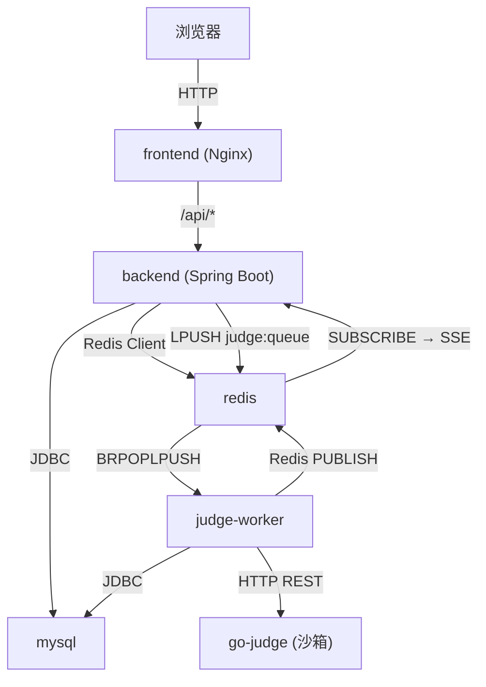
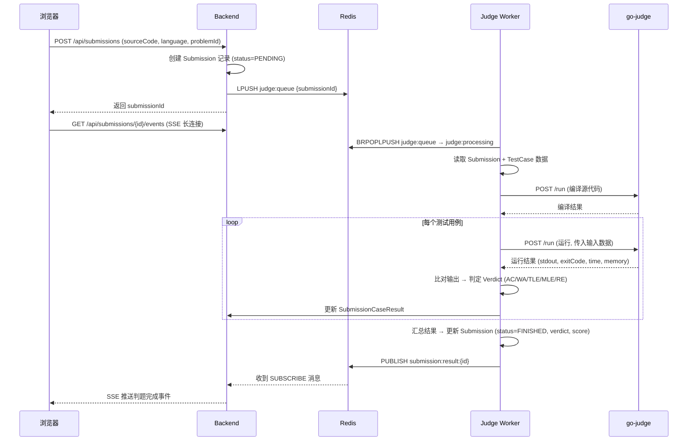
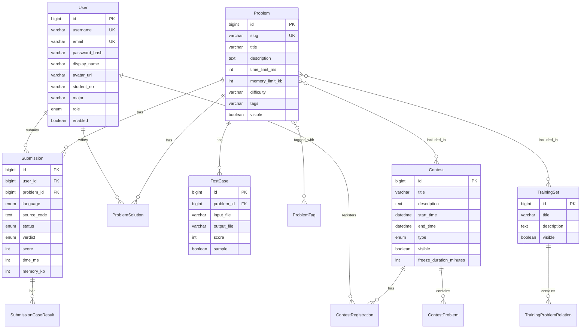
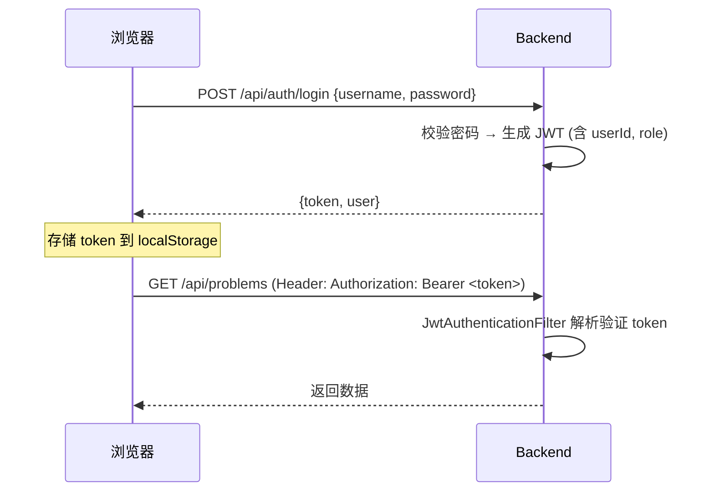

# 架构设计文档

本文档详细描述 CodeRush OJ 系统的整体架构设计、核心数据流、数据库模型及各服务间的交互方式。

---

## 1. 系统架构概览

CodeRush OJ 采用 **前后端分离 + 判题微服务** 的架构，共由 6 个 Docker 容器组成：

| 服务 | 容器名 | 技术 | 职责 |
|------|--------|------|------|
| **frontend** | localoj-frontend | Nginx + Vue 3 SPA | 静态资源服务 + API 反向代理 |
| **backend** | localoj-backend | Spring Boot 3.5 (Java 21) | REST API、业务逻辑、认证授权 |
| **judge-worker** | localoj-judge-worker | Spring Boot 3.5 (Java 21) | 判题队列消费者，调用沙箱执行评测 |
| **go-judge** | localoj-go-judge | go-judge v1.12 | 安全沙箱，编译运行用户代码 |
| **mysql** | localoj-mysql | MySQL 8.4 | 关系型数据持久化 |
| **redis** | localoj-redis | Redis 7.4 Alpine | 判题任务队列 + SSE 结果推送 |

### 服务依赖关系



---

## 2. Maven 多模块结构

项目采用 Maven 多模块 (Multi-Module) 组织后端 Java 代码：

```
local-oj (parent pom)
├── common       → 共享实体、Mapper 接口、枚举、消息体
├── backend      → REST API 服务 (依赖 common)
└── judge-worker → 判题消费者服务 (依赖 common)
```

**common** 模块被 backend 和 judge-worker 同时依赖，包含：
- `model/` — 19 个数据库实体类 (MyBatis-Plus 注解映射)
- `mapper/` — 19 个 MyBatis-Plus Mapper 接口
- `enums/` — `Language`, `Role`, `Verdict`, `SubmissionStatus` 等枚举
- `queue/` — `JudgeJob` 判题任务消息体

---

## 3. 核心数据流

### 3.1 用户提交代码 → 判题 → 返回结果



### 3.2 评测结果判定 (Verdict)

| Verdict | 含义 |
|---------|------|
| **AC** | Accepted — 输出完全正确 |
| **WA** | Wrong Answer — 输出与预期不符 |
| **TLE** | Time Limit Exceeded — 超时 |
| **MLE** | Memory Limit Exceeded — 超内存 |
| **OLE** | Output Limit Exceeded — 输出超限 |
| **RE** | Runtime Error — 运行时错误 |
| **CE** | Compilation Error — 编译错误 |
| **IE** | Internal Error — 系统内部错误 |

---

## 4. 数据库模型

数据库使用 Flyway 管理迁移 (V1 ~ V26)，核心表结构如下：

### 4.1 ER 关系图



### 4.2 核心表清单

| 表名 | 说明 |
|------|------|
| `user` | 用户表 (username, email, role, password_hash 等) |
| `problem` | 题目表 (slug, title, description, limits, difficulty) |
| `test_case` | 测试用例表 (关联 problem，输入/输出文件路径) |
| `submission` | 提交记录表 (user, problem, language, verdict, score) |
| `submission_case_result` | 每个测试点的评测结果 |
| `contest` | 竞赛表 (ACM/OI 赛制, 时间, 封榜) |
| `contest_problem` | 竞赛-题目关联表 (含题目序号) |
| `contest_registration` | 竞赛报名表 |
| `contest_problem_visibility_lock` | 竞赛题目可见性锁定 |
| `training_set` | 训练集表 |
| `training_problem_relation` | 训练集-题目关联表 |
| `problem_tag` | 标签表 |
| `problem_tag_relation` | 题目-标签关联表 |
| `problem_solution` | 题解表 |
| `smtp_setting` | SMTP 邮件配置表 |
| `sandbox_setting` | 沙箱参数配置表 |
| `system_setting` | 系统全局配置表 |
| `system_log` | 系统操作日志表 |
| `email_verification_code` | 邮箱验证码表 |
| `user_rank_snapshot` | 用户排名快照表 |

---

## 5. 认证与授权

### 5.1 JWT 认证流程



### 5.2 权限体系

系统采用三级角色模型：

| 角色 | 权限范围 |
|------|---------|
| **SUPER_ADMIN** | 全部权限：用户管理、系统设置、日志查看、数据导入导出 |
| **ADMIN** | 题目/竞赛/训练集管理、提交记录查看 |
| **STUDENT** | 浏览题目、提交代码、参加竞赛、查看排行榜、发布题解 |

前端路由通过 `meta.requiresAuth` / `meta.requiresAdmin` / `meta.requiresSuperAdmin` 进行页面级权限守卫。

---

## 6. 判题队列与沙箱

### 6.1 Redis 队列架构

判题任务采用 Redis List 实现可靠消息队列：

| Key | 类型 | 用途 |
|-----|------|------|
| `judge:queue` | List | 待判题任务队列 |
| `judge:processing` | List | 正在处理的任务 (BRPOPLPUSH 原子移动) |
| `judge:dlq` | List | 死信队列 (多次失败的任务) |

**消费模型**: Judge Worker 使用 `BRPOPLPUSH` 原子操作从 `judge:queue` 弹出任务并推入 `judge:processing`，确保任务不丢失。评测完成后从 processing 移除。

### 6.2 go-judge 沙箱

go-judge 容器以 **privileged 模式** 运行，内置以下编译运行环境：

- GCC / G++ (C/C++ 编译)
- OpenJDK 21 (Java 编译运行)
- CPython 3.12 (Python 解释执行)
- PyPy3 (Python 加速运行)

沙箱通过 HTTP REST API (`POST /run`) 接受编译/运行请求，对每次执行施加：
- CPU 时间限制
- 实际时间限制 (Wall Clock)
- 内存限制
- 输出大小限制
- 进程数限制

### 6.3 SSE 实时推送

用户提交代码后，前端通过 **Server-Sent Events (SSE)** 长连接监听判题结果：

1. Backend 订阅 Redis 频道 `submission:result:{submissionId}`
2. Judge Worker 评测完成后 `PUBLISH` 到该频道
3. Backend 收到消息后通过 SSE 推送给前端
4. 前端实时更新 verdict、耗时、内存等信息

---

## 7. 前端架构

### 7.1 技术选型

| 关注点 | 方案 |
|--------|------|
| UI 框架 | Vue 3 Composition API (SFC) |
| 类型安全 | TypeScript |
| 构建工具 | Vite 7 |
| UI 组件库 | Element Plus |
| 状态管理 | Pinia |
| 路由 | Vue Router (History Mode) |
| HTTP | Axios (统一封装) |
| 代码编辑器 | Monaco Editor (离线加载) |
| Markdown | markdown-it + DOMPurify (XSS 防护) |
| 数学公式 | KaTeX (离线渲染) |

### 7.2 关键设计

- **离线优先**: Monaco Editor 和 KaTeX 资源在构建时复制到 `public/libs/`，无需 CDN
- **API 统一封装**: 所有 API 调用集中在 `src/api/http.ts`，自动附加 JWT token
- **懒加载路由**: 除首页和登录页外，所有页面组件使用动态 `import()` 按需加载
- **代码分割**: Vite 构建时将 Element Plus、Monaco Editor、KaTeX 分离为独立 chunk

---

## 8. 数据存储

所有运行时数据挂载到项目根目录的 `./data/` 下：

```
data/
├── mysql/       # MySQL 数据文件 (InnoDB 表空间)
├── redis/       # Redis RDB/AOF 持久化文件
└── oj/
    ├── testcases/   # 题目测试数据文件 (输入/输出)
    └── logs/        # 后端应用日志
```

这种本地目录挂载方式（相比 Docker 命名卷）的优势：
- 备份简单：直接压缩 `data/` 目录即可
- 可视化：方便在宿主机上直接查看数据文件
- 迁移方便：整个项目目录打包即包含完整数据
