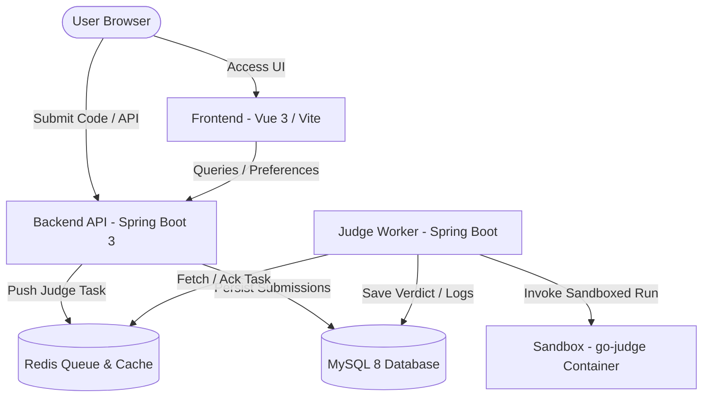

# CodeRush OJ - Project Overview

CodeRush OJ is a lightweight, self-contained internal Online Judge (OJ) system designed for training, exams, and code practice in secure, isolated internal networks. It focuses on absolute robustness, visual excellence, and complete offline capability.

---

## 🚀 System Architecture

The project employs a decoupled, containerized microservices architecture to enforce sandboxed security and high reliability.



### 1. Frontend (`frontend/`)
- **Technology Stack**: Vue 3 + Vite + TypeScript + Element Plus + Monaco Editor.
- **Key Features**:
  - **Dynamic Theme**: Supports standard light mode and premium dark mode interfaces.
  - **Custom Code Workspace**: Split-pane draggable divider separating problem statements and coding editor.
  - **Local Offline Fonts**: Serves body font (`Plus Jakarta Sans`) and code fonts (`JetBrains Mono`, `Fira Code`, `Source Code Pro`, `IBM Plex Mono`, `Ubuntu Mono`) completely offline using localized NPM `@fontsource` packages.
  - **Client-side Compression**: Compresses user avatar uploads into optimized WebP format on the client side before uploading to respect the backend 2MB limit.
  - **Real-time Previews**: Instant visual preview of editor font, size, and reader typography configurations in the user profile page.

### 2. Backend API (`backend/`)
- **Technology Stack**: Spring Boot 3 + Java 21 + MyBatis-Plus + Spring Security / JWT.
- **Key Features**:
  - **Problem Management**: Single Markdown document authoring (no split input/output fields). Batch problem importing via standard ZIP format (markdown statement, YAML metadata config, same-basename `.in`/`.out`/`.ans` test cases).
  - **Submission Boundaries**: Practice submission history and problem status queries exclude contest submissions; contest submissions are served through contest-scoped APIs so registration and visibility rules stay centralized.
  - **SMTP Verified Settings**: User password changes and registrations utilize SMTP-verified code verification. Settings are managed dynamically in the administrative backend.
  - **Task Dispatcher**: Pushes submission judging tasks asynchronously to Redis and monitors state.

### 3. Judge Worker (`judge-worker/`)
- **Technology Stack**: Spring Boot 3 + Java 21 + MyBatis-Plus + Redis queue processing.
- **Key Features**:
  - **Deterministic Task Processing**: Moves submission tasks atomically from a Redis pending queue to an active processing queue to prevent loss.
  - **Restart Recovery**: Uses a stable `APP_WORKER_ID` to recover that worker's Redis processing queue on startup without age-based duplicate judging of active `RUNNING` submissions.
  - **Sandbox Orchestrator**: Submits compiled binary, source codes, execution limits, and paired test inputs to `go-judge` via HTTP API, then parses execution states.
  - **Verdicts Normalization**: Resolves executions into clean standard OJ verdicts: `AC` (Accepted), `WA` (Wrong Answer), `TLE` (Time Limit Exceeded), `MLE` (Memory Limit Exceeded), `OLE` (Output Limit Exceeded), `RE` (Runtime Error), `CE` (Compilation Error), and `IE` (Internal Error).

### 4. Sandbox Execution Engine (`docker/go-judge/`)
- **Technology Stack**: `criyle/go-judge:v1.12.0` with custom multi-stage Python 3.12 layer and native compilers.
- **Key Features**:
  - **Supported Languages**:
    - **C++**: Compiles with GCC 14.2 using the **`C++20`** standard (`-std=c++20 -O2 -pipe`).
    - **C**: Compiles with GCC 14.2 using C11 (`-O2 -pipe`).
    - **Python**: Evaluates with a pinned **`Python 3.12`** slim runtime.
    - **Java**: Compiles and runs using **`OpenJDK 21`** headless runtime.
  - **Security Isolation**: treat submitted code as completely untrusted. Executed inside isolated namespaces and cgroups with network access fully disabled.

---

## 📂 Project Directory Structure

```text
d:\Code\project\
├── backend/               # Main Backend API service (Spring Boot)
├── common/                # Shared domain models, mappers, and utilities
├── judge-worker/          # Judge queue consumer & go-judge controller
├── frontend/              # User-facing Single Page Application (Vue 3 / Vite)
├── docker/
│   └── go-judge/          # Custom Dockerfile packing compiler tools & Python 3.12
├── docx/                  # System documentation & technical specifications
├── docker-compose.yml     # Multi-container local orchestration script
├── .env.example           # Shared environment configurations template
└── pom.xml                # Root Maven configuration mapping common/backend/worker modules
```
